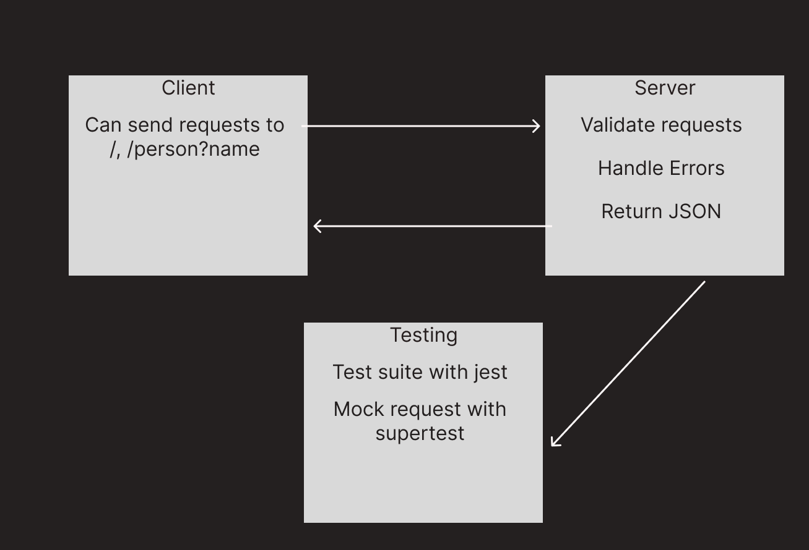

# basic-express-server (LAB 02)

## Project: Server Deployment Practice... again?

### Author: Tyler Bennett

### Problem Domain  

Basic API Server where we write some middleware and practice writing tests... but like again.

### Links and Resources

- [ci/cd](https://github.com/tyler-bennett52/basic-express-server/actions) (GitHub Actions)
- [back-end server url](https://basic-express-server-eulv.onrender.com) (when applicable)

### Setup

#### `.env` requirements (where applicable)

Only env variable is PORT

#### How to initialize/run your application (where applicable)

- `npm start`

#### How to use your library (where applicable)

#### Features / Routes

- Feature One: Run tests?

#### Tests

fill this in as you see fit
- How do you run tests? npm test
- Any tests of note? no
- Describe any tests that you did not complete, skipped, etc. - I used 2 temporary tests in the validator and logger test files. The validator is being tested in the integration test and I am not sure how to test for a console log. I considered deleting these two files altogether but they are listed under the proposed file structure so I figure they should be there, but with nothing there they are causing fails due to no tests present.

#### UML

